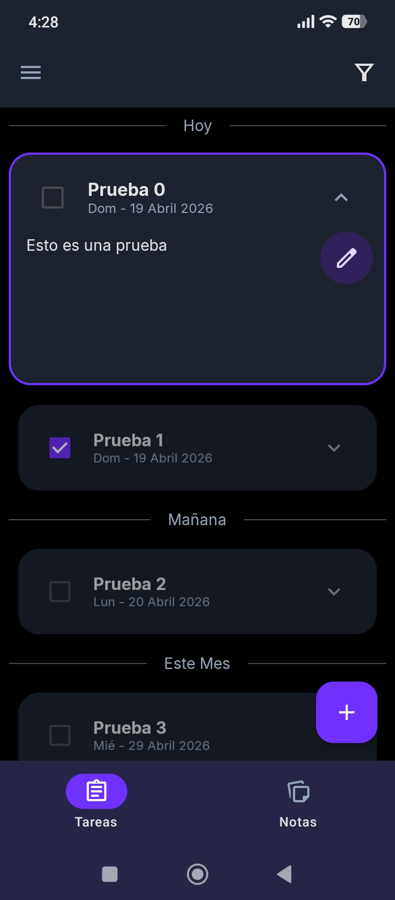
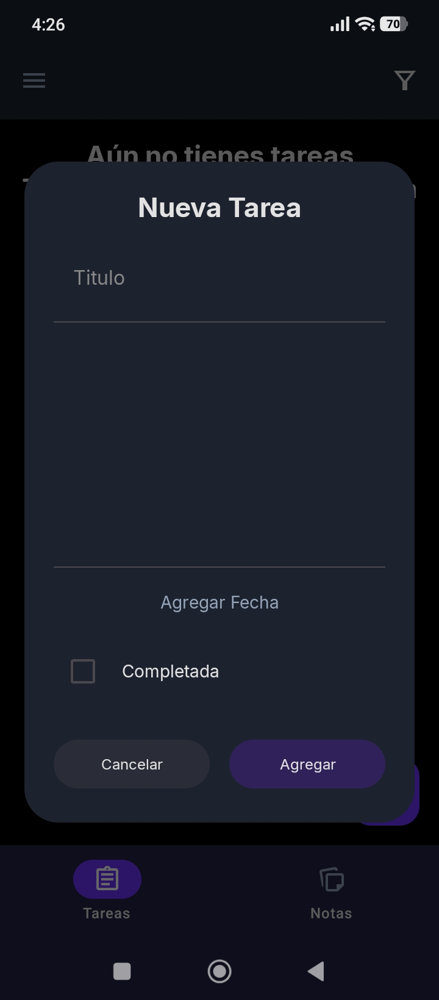
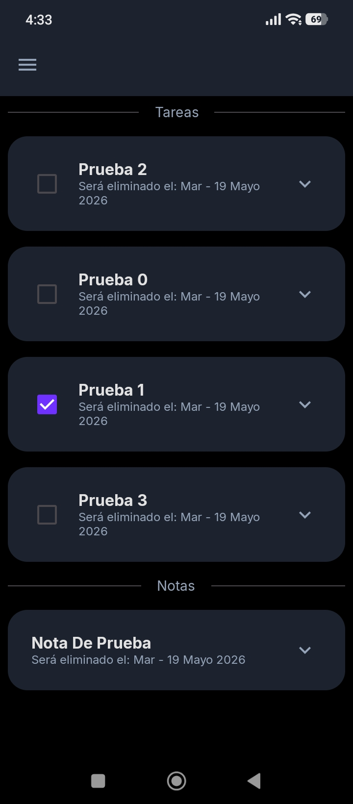
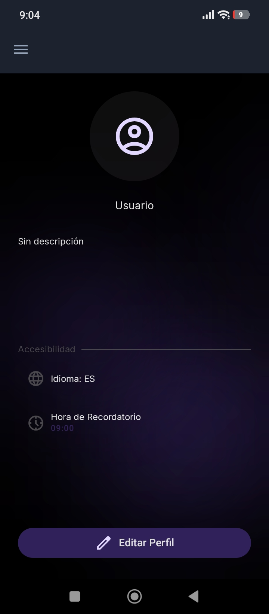

# Noir Assistant

**Noir Assistant** es una herramienta de organización personal diseñada para funcionar como un asistente útil, modular y eficiente. Su enfoque principal es la centralización de tareas y notas bajo una arquitectura sólida y almacenamiento local, permitiendo al usuario gestionar su día a día con rapidez y estructura.

Inspirada en la agilidad de herramientas de productividad modernas, busca ofrecer una experiencia fluida donde la gestión de la información sea inmediata y privada.

## Vista previa

---

## Funcionalidades

### Gestión de Tareas

- **Control Total (CRUD):** Creación y edición de tareas a través de un diálogo unificado, reutilizando la misma interfaz para mantener consistencia y reducir fricción en la interacción.

- **Eliminación con Gestos:** Las tareas pueden eliminarse mediante swipe horizontal hacia la derecha, proporcionando una interacción rápida y natural.

- **Deshacer Acciones (Undo):** Al eliminar una tarea, se muestra un SnackBar que permite revertir la acción antes de que se envíe definitivamente a la papelera.

- **Seguimiento Eficiente:** Asignación de fechas y estados de finalización para el control de actividades.

- **Organización Temporal:** Visualización de tareas agrupadas por secciones de tiempo en la interfaz principal, facilitando la planificación y visualización.

### Gestión de Notas

- **Captura Rápida y Flexible:** Creación y edición de notas mediante un diálogo unificado, priorizando velocidad y mínima fricción al registrar ideas.

- **Interacción Consistente:** Comparte patrones de uso con el sistema de tareas (creación, edición y eliminación), manteniendo una experiencia uniforme en toda la aplicación.

- **Modelo Simplificado:** A diferencia de las tareas, las notas no incluyen estados ni temporalidad, enfocándose en contenido libre y sin estructura rígida.

- **Persistencia Robusta:** Construido sobre la misma base de almacenamiento confiable, garantizando consistencia y estabilidad en los datos.

### Navegación

- **Estructura por Contextos:** La aplicación organiza su flujo en secciones principales:
  - Inicio (Tareas y Notas)
  - Papelera
  - Cuenta
- **Menú Lateral (Drawer):** La navegación global se gestiona mediante una barra lateral deslizable, que cubre la pantalla y permite cambiar de contexto de forma clara y centralizada.
- **Navegación Local (Bottom Bar):** Dentro del contexto principal (Inicio), se utiliza una barra inferior para alternar rápidamente entre:
  - Tareas 
  - Notas
  
Esto evita sobrecargar el menú principal con cambios frecuentes donde se distinguen dos niveles de navegación:
- Global: cambio de secciones (drawer)
- Local: cambio de contenido dentro de una sección (bottom bar)

### Papelera de Reciclaje (Soft Delete)

- **Borrado Lógico:** Tanto tareas como notas implementan eliminación lógica mediante un campo deletedAt lo que evita eliminaciones inmediatas y protege contra pérdida de datos.
  - `0L` → la entidad está activa
  - `> 0` → la entidad fue enviada a la papelera

- **Expiración Automática:** Al eliminar una entidad, se asigna una fecha de expiración (por defecto 30 días). Antes de inicializar la UI, el sistema: Verifica entidades expiradas y ejecuta su eliminación definitiva. Lo que mantiene la base de datos limpia sin intervención del usuario. 

- **Restauración Controlada:** Desde la papelera, el usuario puede restaurar elementos mediante un boton.
  - La restauración devuelve la entidad a su estado activo 
  - Se muestra un SnackBar con opción de deshacer

- **Eliminación Permanente:**
  - También es posible eliminar definitivamente una entidad de forma manual: Acción mediante un botón
  - Confirmación a través de diálogo de advertencia evitando eliminación accidental mediante fricción intencional.

### Cuenta de Usuario y Preferencias

- **Gestión de Perfil:** Pantalla de cuenta integral que permite la personalización de la identidad del usuario (nombre, biografía y foto de perfil) con estados de edición y visualización diferenciados.
- **Sistema de Edición de Imagen:** Implementación de un visor de recorte circular personalizado.
  - Soporte para gestos multitáctiles (pan y zoom) mediante graphicsLayer para ajustar la composición de la foto de perfil.
  - Persistencia de coordenadas de transformación (X, Y) y nivel de escala (zoom) para garantizar un renderizado consistente sin procesar la imagen físicamente.
- **Internacionalización Dinámica**:
  - Selector de idioma in-app (Español/Inglés) que permite al usuario sobrescribir el idioma de la app en tiempo de ejecución. 
  - Aplicación reactiva de Locales mediante AppCompatDelegate, permitiendo cambios de idioma en tiempo real sin reiniciar la aplicación.
- **Persistencia con Jetpack DataStore:** Almacenamiento reactivo mediante flujos de datos (Flow). 
  - Arquitectura desacoplada: el sistema distingue entre actualizaciones de perfil (identidad) y actualizaciones de configuración (accesibilidad/idioma) para optimizar el rendimiento.
- **Configuración de Recordatorios:** Implementación de un selector de hora interactivo para personalizar la alerta diaria.
  - **Selector de Rueda Finito:** Diseño de un `FiniteWheelPicker` para horas y minutos que ofrece un desplazamiento suave, deteniéndose en los límites de tiempo.
  - **Feedback Visual Dinámico:** Los elementos de la rueda ajustan su opacidad (alpha) en tiempo real según su proximidad al centro, proporcionando una experiencia visual fluida.
  - **Sincronización de Preferencias:** La hora seleccionada se persiste en DataStore y se vincula con el sistema de notificaciones para garantizar la puntualidad de los avisos.

### Sistema de Notificaciones Resilientes
- **Recordatorios Proactivos:** Sistema de alertas automáticas de manera diaria que informan al usuario sobre el estado de sus tareas pendientes y atrasadas.
- **Arquitectura de Alta Precisión:** - **AlarmManager (`setAlarmClock`):** Implementación de alarmas de precisión extrema que garantizan la ejecución incluso en modos de ahorro de energía agresivos (Doze Mode).
  - **WorkManager:** Gestión de tareas en segundo plano para procesar la lógica de negocio y preparar el contenido de la notificación de forma eficiente.
- **Resiliencia ante Reinicios:** Uso de `RECEIVE_BOOT_COMPLETED` para re-agendar automáticamente los recordatorios al encender el dispositivo, asegurando que el asistente nunca pierda su ciclo de alerta.
- **Interfaz Visual Adaptativa:** Notificaciones con estilo enriquecido que incluyen el logo de identidad de la app y soporte para mensajes expandibles, facilitando la lectura de listas de tareas desde la pantalla de bloqueo.

### Sistema de Arranque y Optimización
- **Inicio Optimizado (Baseline Profiles):** La aplicación incorpora Baseline Profiles para mejorar el rendimiento en tiempo de arranque, reduciendo tiempos de carga y evitando compilación en caliente en rutas críticas.
- **Inicialización Controlada:** Antes de renderizar la UI, se ejecuta una fase de preparación donde se garantiza que el estado base de la aplicación esté listo.
- **Precarga de Datos (Warm-Up):** El MainViewModel actúa como punto de entrada del sistema y realiza una precarga de la base de datos, asegurando que:
  - Las consultas iniciales estén listas
  - Se reduzca latencia en la primera renderización evitando el “lag inicial” típico al abrir la app.
- **Sincronización de Configuración Global:** Durante el arranque, el MainViewModel obtiene el idioma persistido y lo aplica. Lo que hace que la aplicación inicia directamente en el idioma correcto, sin transiciones visibles.

---

## Arquitectura y Flujo de Datos

- **Arquitectura Unidireccional:**  
  Separación estricta entre las capas de:
    - Base de Datos (Room/DataStore)
    - Dominio
    - UI

  Esto facilita el mantenimiento y la escalabilidad del proyecto.

- **Reactividad:**  
  Uso de flujos reactivos (`Flow`) para que la interfaz se actualice automáticamente ante cualquier cambio en la base de datos.

- **Optimización:**  
  Implementación de **Baseline Profiles** para maximizar el rendimiento en la ejecución y reducir los tiempos de arranque.

---

## Tecnologías utilizadas

- **Kotlin** 
  Lenguaje principal para la lógica de negocio.

- **Jetpack Compose**  
  Framework moderno para la construcción de interfaces declarativas y reactivas.

- **Room Persistence**  
  Biblioteca de abstracción sobre SQLite para el almacenamiento local y seguro de datos.

- **Material Design 3**  
  Estándar de diseño para componentes reutilizables y modulares.

- **Jetpack DataStore**
  Persistencia de datos de configuración y perfil.

- **Coil**
  Carga de imágenes asíncrona.

- **AppCompat Library**
  Utilizada como puente para la gestión avanzada de localización e internacionalización, permitiendo el cambio de idioma in-app

- **Baseline Profiles**  
  Herramienta de optimización de rendimiento en tiempo de ejecución.

- **WorkManager**
  Programación de tareas en segundo plano garantizadas y persistentes. **[Nuevo]**

- **AlarmManager**
  Programación de eventos exactos a nivel de sistema. **[Nuevo]**

- **Broadcast Receivers**
  Escucha de eventos del sistema (como el arranque del dispositivo) para mantener la continuidad del servicio. **[Nuevo]**

---

## Requisitos del Sistema y Especificaciones Técnicas
- **Min SDK:** API 26 (Android 8.0 Oreo) — Garantiza compatibilidad con funciones modernas de notificaciones y gestión de alarmas.

- **Target SDK:** API 35 (Android 15) — La aplicación está optimizada para las versiones más recientes del sistema.

- **Versión Actual De La Aplicación:** 1.3.0 (Build 5).

---

## Cómo ejecutar el proyecto 🚀

Para tener una copia local de **Noir Assistant** en funcionamiento, sigue estos pasos:

1. **Clonar el repositorio desde Android Studio:**
   - Abre Android Studio.
   - En la pantalla de bienvenida o en el menú superior, selecciona **File > New > Project from Version Control...**
   - En la opción **Repository URL**, pega el enlace de este repositorio: `https://github.com/AFGalindoB/Noir-Assistant.git`
   - Haz clic en **Clone**.
2. **Sincronización de Gradle:**
   - Una vez finalizada la clonación, Android Studio detectará automáticamente los archivos de configuración.
   - Espera a que la barra de progreso de **Gradle Sync** termine de descargar todas las dependencias necesarias.
3. **Ejecución:**
  - Conecta un dispositivo físico (con la depuración USB activada) o inicia un emulador.
  - Haz clic en el botón **Run** (el icono de "Play" verde ▶️) en la barra de herramientas superior.
  - El proceso de `build` compilará el proyecto e instalará la aplicación automáticamente.

> **Nota:** Asegúrate de tener instalada la versión más reciente de Android Studio y el SDK de Android correspondiente para garantizar la compatibilidad con Jetpack Compose y las dependencias.

---

## Licencia

Este proyecto está bajo la **Licencia MIT**.

Fiel a la filosofía de Software Libre, **Noir Assistant** es una herramienta abierta, escalable y adaptable, diseñada para ser un asistente personal eficiente y centrado en el usuario.

---

## Documentación adicional

Para más detalles técnicos sobre la implementación consulte:

### Flujo de Datos
* [Flujo de Datos con Room (Persistencia de Tareas y Notas)](docs/Room_Data_Flow.md)
* [Flujo de Preferencias con DataStore (Perfil de Usuario)](docs/DataStore_Data_Flow.md)
* [Ciclo de Vida de Notificaciones y Alarmas (Resiliencia)](docs/Notifications_Logic.md)